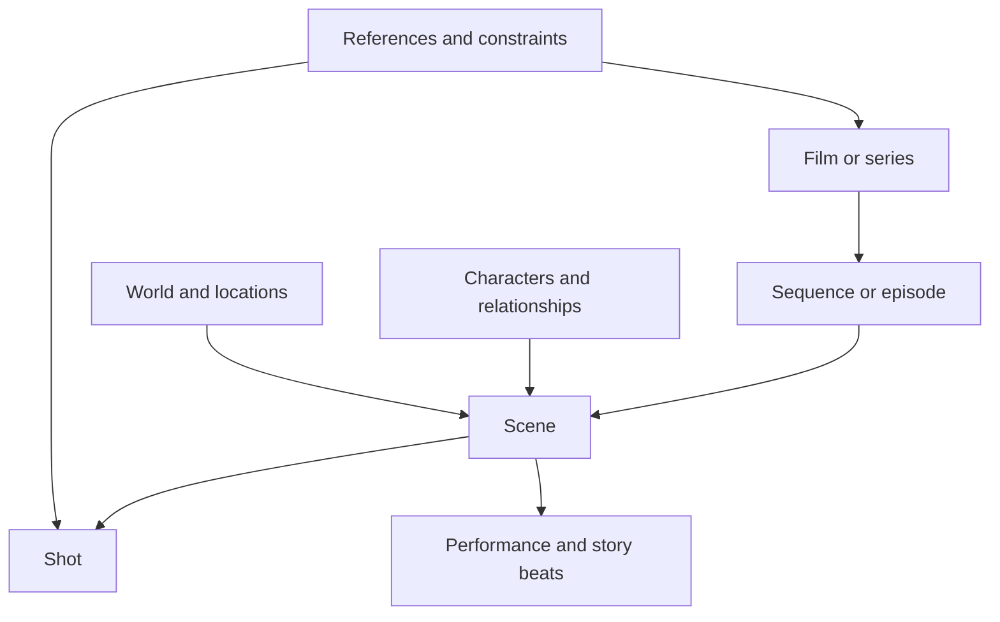

# How to use the atlas

[Wiki home](../README.md) · [Alphabetical index](../INDEX.md)

The atlas supports three activities: learning the vocabulary, comparing creative alternatives, and describing a specific work. These activities share terms but produce different kinds of records.

## Read a term

Every glossary entry has a definition, a practical use, and an original hypothetical example. The example demonstrates one possible application; it is not an instruction to repeat that scene or a claim about a released film. Each chapter also contains distinctions, related chapters, source notes, and proposed visual/data controls.

Use the alphabetical index when you know a term. Use the chapter list when you know the area of a decision. Use the routes below when you know the creative problem but lack the vocabulary.

## Browse by creative question

| Your question | Start here | Then consider |
|---|---|---|
| What kind of work am I making? | [Form, format, and genre](../wiki/01-form-format-and-genre.md) | [Premise and theme](../wiki/02-premise-theme-and-meaning.md) |
| What keeps the story moving? | [Story patterns and engines](../wiki/03-story-patterns-and-dramatic-engines.md) | [Structure and time](../wiki/04-narrative-structure-and-time.md) |
| Why does this person matter? | [Character roles](../wiki/06-character-roles.md) | [Archetypes and construction](../wiki/07-character-archetypes-and-construction.md) |
| How do these people change? | [Arcs and relationships](../wiki/08-character-arcs-and-relationships.md) | [Television storytelling](../wiki/05-television-storytelling.md) |
| What is this world like to inhabit? | [World and setting](../wiki/09-world-and-setting.md) | [Production design](../wiki/13-production-design-and-appearance.md) |
| What does this scene accomplish? | [Scenes and sequences](../wiki/10-scenes-and-sequences.md) | [Perspective and audience](../wiki/11-perspective-and-audience-experience.md) |
| How do I make the scene playable? | [Performance and blocking](../wiki/12-dialogue-performance-and-blocking.md) | [Shot composition](../wiki/14-shot-size-angle-and-composition.md) |
| Where should the camera be? | [Shot composition](../wiki/14-shot-size-angle-and-composition.md) | [Movement](../wiki/15-camera-movement-and-support.md) and [lenses](../wiki/16-lens-focus-and-image-capture.md) |
| What gives the image its atmosphere? | [Lighting and color](../wiki/17-lighting-and-color.md) | [Production design](../wiki/13-production-design-and-appearance.md) |
| Why does the passage feel slow or rushed? | [Editing and pace](../wiki/18-editing-transitions-and-pace.md) | [Sound and music](../wiki/19-sound-voice-and-music.md) |
| How should impossible action be represented? | [Animation and effects](../wiki/20-animation-effects-and-mixed-techniques.md) | [References and constraints](../wiki/22-references-and-creative-constraints.md) |
| What claims is this nonfiction work making? | [Documentary](../wiki/21-documentary-and-nonfiction.md) | [Perspective and audience](../wiki/11-perspective-and-audience-experience.md) |

## Apply vocabulary to a project

Begin with a plain-language intention. “A mechanic discovers someone is still using the abandoned station” is enough to start. Then select the dimensions that materially affect that intention.

1. **Define the event.** Who wants what? What occurs? What changes, if anything?
2. **Choose audience access.** What does the viewer know before the character, alongside them, or afterward?
3. **Choose performance and space.** How do people move, speak, wait, and respond?
4. **Choose presentation.** Specify framing, movement, light, sound, and editing independently.
5. **Record the reason.** Keep the creative intention beside the technical choice.
6. **Review the result.** Observe whether the actual scene supports that intention; do not treat saved settings as proof of an achieved effect.

You do not need to fill every field. An undecided lens is a valid state. A deliberately open character motivation is a valid creative choice. Unknown values should stay unknown rather than become arbitrary numbers.

## Combine dimensions instead of choosing one label

| Object | Independent dimensions | Example combination |
|---|---|---|
| Work | Form, medium, format, genre, tone | Animated short, mystery, melancholic tone |
| Character | Role, archetype, motivation, flaw, arc | Protagonist, caregiver, seeks belonging, controlling, learns trust |
| Scene | Activity, function, setting, knowledge change | Meal, negotiation, public canteen, hidden allegiance revealed |
| Shot | Size, angle, composition, movement, function | Medium close-up, eye level, off-center, slow dolly in, reaction |
| Sound | Source, story-world status, visibility, perspective | Radio music, diegetic, off-screen, heard through a closed door |
| Reference | Source, dimension, influence, adaptation | A clip's camera restraint, moderate influence, different blocking |

## Work at several scales

This is a simplified navigation map, not a rigid containment schema. A television series also has seasons; a sequence can cross scene boundaries; sound can span several shots; a performance beat is not the same object as an edit.

## Keep four kinds of statement separate

- **Definition:** what a reusable term means in this wiki.
- **Intention:** what you want a creative choice to contribute.
- **Decision:** what is currently selected for a specific project.
- **Observation:** what a reviewer or audience actually noticed in an existing result.

An agent can help select and change decisions. It should not silently redefine a shared term, replace an intention with its own preference, or report an audience response that has not been observed.

## Related guides

- [Editing and extending the vocabulary](entry-template.md)
- [Agent-readable representation](agent-representation.md)
- [Worked discovery scene](../examples/discovery-scene.md)
